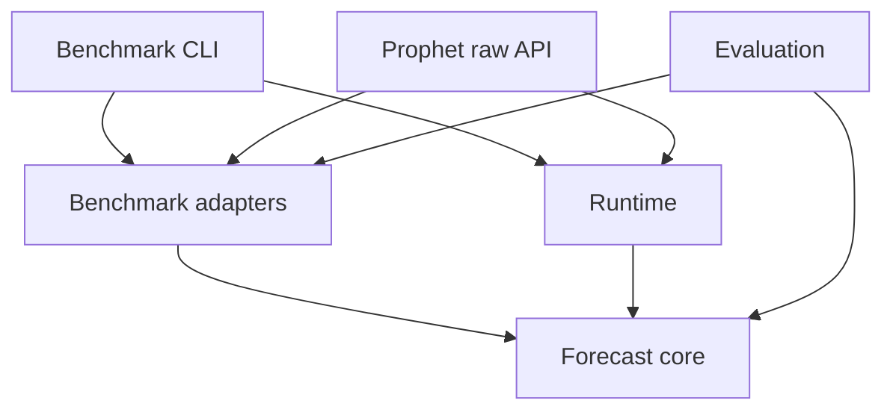

# 架构说明

## 目标

把“预测本身”与“参加某个 benchmark 的协议”分离。核心层只理解任务、概率、证据和信息政策；FutureX、ForecastBench、Prophet Arena 的字段、提交格式和评分由 adapter 管理。

## 依赖方向



`forecast-core` 不得反向引用其他层。`scripts/check-boundaries.mjs` 会在 CI 中验证这一点。

## 核心契约

`ForecastTask` 是 discriminated union：

```text
binary_probability
categorical
multi_label
ranking
numeric
free_response
```

所有任务都带：

- benchmark/round/external ID；
- `asOfUtc`；
- deadline 与 resolution contract；
- 显式 `InformationPolicy`；
- 与外部 schema 隔离的内部 metadata。

`ForecastResult` 保存聚合答案、每次 trial、模型、策略、policy、时间、fallback 和 warning。Benchmark adapter 最后才把它序列化成官方格式。

## 信息政策

一个布尔 `marketBlind` 无法表达三个 benchmark 的差异，因此每个 job 都必须提供完整政策：

| Profile | Prediction-market price | Supplied market stats | 普通金融数据 |
| --- | --- | --- | --- |
| FutureX | observe | deny | allow |
| ForecastBench market | anchor | deny | allow |
| ForecastBench dataset | deny | deny | allow |
| Prophet Arena | observe | anchor | allow |
| Strict blind | resolution metadata only | deny | allow |

核心层会验证结构化 `EvidenceRecord` 的发布时间、observed-at、域名和 source class；但厂商 research 当前只返回 citation URL，尚未形成可证明历史时点的冻结证据包。因此 CLI 禁止把 live research 用于 backtest；完整 frozen-evidence adapter 仍是后续工作。

## Predictor

`OpenAICompatiblePredictor` 默认适配 Foresight v4，但 base URL、model 和 key 可替换。客户端：

- 使用原生 fetch，不引入厂商 SDK；
- 支持 Foresight `<answer>` 结构、annotations 和 usage；
- 统一 AbortSignal 与 timeout；
- 不把 API key写入 artifact。

核心引擎并行运行独立 trials：binary 用 logit pooling；categorical 平均分布；multi-label 平均 inclusion probability；ranking 用 Borda；numeric 用 trimmed mean；free response 用规范化多数。

## Baseline-first 与恢复

ForecastBench 和 Prophet 在调用模型前都能生成 deterministic baseline：

- ForecastBench market：新鲜概率优先，否则 freeze value；
- dataset：source safety prior；
- Prophet：`(yesAsk + 1 - noAsk) / 2`，缺失时 last price，再缺失为 0.5。

模型成功后再做 bounded update。失败、超时或非法输出时保留 baseline，并明确标记 fallback。批处理按固定间隔并在结束时原子写入带身份校验的 checkpoint，支持安全恢复。

## 外部协议

### FutureX

固定 40 位 dataset SHA；按 prompt 而非 level 判断题型；官方附件只含 `id`/`prediction`。数组、rationale、未知 ID、空答案、非法数值或过期提交 fail closed。

### ForecastBench

唯一键为 `(source,id,resolution_date|null)`。Market 一题一行，dataset 严格展开官方日期，不假设永远八个 horizon。Market/dataset 分别报告 row coverage 和 complete-question coverage，默认只有 100% 才 `safeToUpload`。

### Prophet Arena

一个 event 展开成每个 market/outcome 一个 binary task。Current wire response只含 `probabilities`；legacy 另行编码。默认不跨 market 归一化；只有明确识别 `exclusive`、Top-K 或 threshold geometry 时才投影。

## 安全边界

- 没有钱包、签名、交易 SDK、订单或资金概念。
- 外部提交没有自动化命令。
- Prophet current live endpoint 拒绝带 `resolved_outcome` 的请求。
- 服务端限制 body、并发、鉴权和 request timeout；审计只保存 hash/版本/延迟，不保存 Authorization。
- 历史回测与 live endpoint 必须分离，防止 outcome 泄漏。
