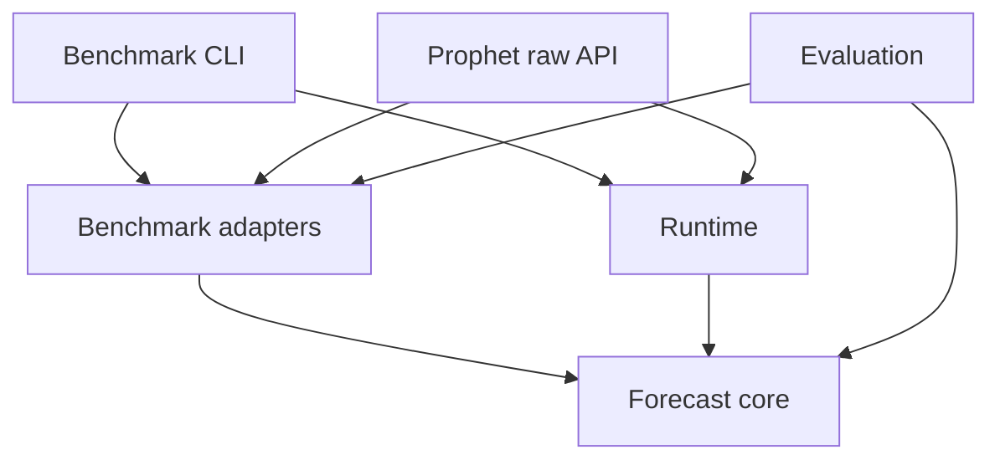

# Architecture

## Purpose

Forecasting logic is separated from benchmark protocols. The core only understands tasks, probabilities, evidence, and information policies. FutureX, ForecastBench, and Prophet Arena adapters own their external fields, output formats, and scoring conventions.

`forecast-core` cannot import the other layers. The boundary script checks this in CI.

## Core contracts

`ForecastTask` supports binary probability, categorical, multi-label, ranking, numeric, and free-response work. Every task carries benchmark/round/external IDs, `asOfUtc`, deadline and resolution contracts, an explicit `InformationPolicy`, and adapter-owned metadata.

`ForecastResult` records the aggregate answer, independent trials, model, strategy, policy, time, fallback state, and warnings. Only the final adapter serializes it into an official format.

## Information policies

One `marketBlind` boolean cannot represent all three benchmarks:

| Profile | Prediction-market prices | Supplied stats | Financial data |
| --- | --- | --- | --- |
| FutureX | observe | deny | allow |
| ForecastBench market | anchor | deny | allow |
| ForecastBench dataset | deny | deny | allow |
| Prophet Arena | observe | anchor | allow |
| Strict blind | resolution metadata only | deny | allow |

The core validates structured `EvidenceRecord` cutoff, observed time, domain, and source class. Provider research currently returns citation URLs rather than a frozen historical evidence bundle, so the CLI blocks live research in backtests; a complete frozen-evidence adapter remains future work.

## Predictor and aggregation

The native-fetch OpenAI-compatible client defaults to Foresight v4, understands tagged answers, annotations, usage, timeout, and shared abort signals. Independent trials are aggregated by logit pooling for binary forecasts, mean distributions for categorical and multi-label tasks, Borda for rankings, trimmed means for numeric tasks, and canonical voting for free responses.

## Baseline-first recovery

ForecastBench and Prophet create deterministic priors before invoking a model. A failed or timed-out model call retains that prior and records a fallback. Batches atomically write identity-checked checkpoints at a fixed interval and on completion, allowing safe resume.

## Adapters

- FutureX pins a 40-character revision, routes from the prompt rather than the level, and exports only `id` and scalar `prediction`. Generated routes preserve detector confidence/reasons and start as `pending`; paid execution requires explicit `approved` or `edited` review state. Partial experiments use a separate pilot/research-snapshot contract with `submissionEligible=false` and can never serialize as an official JSONL attachment.
- ForecastBench keys every row by `(source,id,resolution_date|null)`, expands only official dates, and separately checks market/dataset row and complete-question coverage.
- Prophet expands an event into one binary task per market/outcome. Current and legacy wire encoders stay separate. Independent markets are not normalized unless geometry is explicitly known.

## Safety

There are no wallets, signing keys, trading SDKs, orders, or capital concepts. External submission is not implemented. The live Prophet endpoint rejects resolved outcomes, limits bodies/concurrency/time, authenticates with Bearer, and logs only audit hashes and operational metadata.
