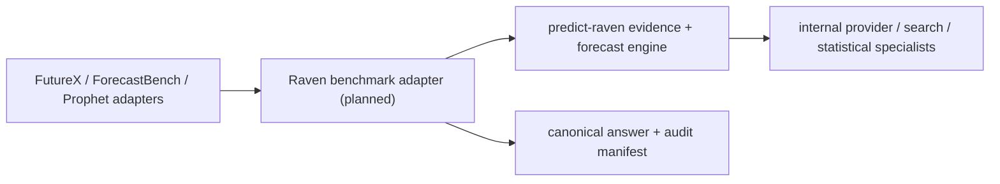

# Three-Benchmark End-to-End Runbook

Last verified: 2026-08-09, Singapore time.

This runbook explains how to use `raven-gonna-test` for an auditable FutureX, ForecastBench, and Prophet Arena test. It separates commands that exist today from manual operations and planned score/operations work. Rules drift; re-check official pages and organizer email before every round.

> **Confirmed system decision: Raven-only.** Official candidates for all three benchmarks must be produced by our self-developed `predict-raven` / Raven Forecasting Engine. A third-party forecasting model is no longer a candidate-generation path. Foundation models, search tools, and data providers used inside Raven are implementation components: record them in the audit manifest while keeping the public system name `Raven`.

> **Current hard block:** paid commands on the current `raven-gonna-test` `main` still instantiate the legacy OpenAI-compatible client; `predict-raven` is not integrated yet. Baseline, fetch, route, validation, and scoring commands in this runbook are usable now. Every benchmark command with `--allow-paid` is blocked until the Raven adapter gate in Section 7 passes. Changing the legacy model string to `raven` is not an integration.

## 1. Required deliverables

A successful three-benchmark test produces four groups of outputs:

1. A valid candidate for each benchmark:
   - FutureX: complete `{id,prediction}` JSONL;
   - ForecastBench: complete GCS-ready JSON;
   - Prophet Arena: an HTTPS endpoint that passes compatibility testing.
2. Checkpoints, manifests, input hashes, model configuration, and fallback records for every model run.
3. Local validator/scorer reports with an explicit submission-eligible or non-eligible status.
4. Human submission/deployment timestamps, object hashes, receipts, and online acceptance evidence.

The repository never sends email, uploads to GCS, completes onboarding, or trades. A human must explicitly perform every external action.

## 2. Status labels

- **[Implemented]**: available and locally tested on current `main`.
- **[Human]**: requires an account, email, website, host, or organizer confirmation.
- **[Planned]**: not implemented; do not treat it as current behavior.
- **[Blocked]**: stop when the condition is unmet; do not bypass it through fallback or renaming.

### 2.1 Current Raven capability boundary

`predict-raven` already has an auditable binary forecasting pipeline: Round 0 frames the event, later rounds search for new evidence, the engine updates `P(YES)` in log-odds space, and it saves `state.json` plus `report.md`. It is separate from the trading path and does not require market prices.

The current engine is binary-only. The three benchmarks also require single choice, multi-label, numeric, ranking, open text, and joint multi-horizon/multi-outcome forecasts. The required architecture is:



Do not connect a benchmark adapter directly to a legacy third-party forecasting endpoint and still label the result Raven.

## 3. Fill the decision sheet before spending

Save this table as `run-decisions.md` inside the run directory. A script must not guess unresolved fields.

| Field | Example | Gate |
| --- | --- | --- |
| Public system name | `Raven` | Keep stable; do not use the internal foundation-model name |
| Agent framework | `raven-gonna-test` | Benchmark adapter and packaging layer |
| Organization | `<stable-organization>` | Confirm once; never let a script guess it |
| `predict-raven` revision | Full 40-character Git SHA | Never a branch, `main`, or short SHA |
| Raven adapter revision | Full `raven-gonna-test` Git SHA | Must contain the adapter actually used |
| Raven backend | `local-library` or `private-service` | Approve exactly one live path |
| Internal provider/model | e.g. `claude/<raw-model-id>` | Audit metadata only, not the Raven identity |
| Evidence rounds | pilot `1`, full cap `<N>` | Hard bound plus early-stop rules |
| Independent replicates | pilot `1`, adaptive `1/3/5` | Share frozen evidence across replicates |
| Evidence policy | official-first + cutoff | Every source must be available by `as-of` |
| Raven round budget | split token/API/subscription | Currently controlled manually |
| Maximum fallback rate | `2%` | Candidate fails above the approved limit |
| FutureX deadline | organizer-confirmed value | Use the earliest value if sources conflict |
| ForecastBench due date | dated question-set root field | Never replace the official file with a guess |
| Prophet wire/SLA | onboarding test result | No public cutover before confirmation |
| External submission owner | name/email | The CLI never submits for this person |

> **Current limitation:** the repository cannot yet total Raven framing, evidence rounds, synthesis, statistical tools, or internal-provider costs, and it has no process-level hard cap. Configure balance limits and alerts at every internal provider and measure real usage with a Raven pilot before a paid full run.

## 4. Recommended artifact layout

Use a new directory for every run; do not overwrite an earlier candidate with `--force`.

```text
runtime-artifacts/
  runs/<run-id>/
    run-decisions.md
    preflight/
    raven/
      engine-identity.json
      engine-config.redacted.json
      usage-summary.json
      tasks/<task-id>/
        state.json
        report.md
        frame.json
        evidence-ledger.json
        source-trace.json
    futurex/
      questions.json
      questions.json.manifest.json
      routes.json
      routes.json.manifest.json
      pilot.json
      pilot.json.checkpoint.json
      submission.jsonl
      submission.jsonl.manifest.json
    forecastbench/
      questions.json
      baseline.json
      candidate.json
      candidate.json.checkpoint.json
      candidate.json.manifest.json
    prophet/
      request.json
      response.json
      response.json.manifest.json
      service-smoke/
    final-review.md
```

Recommended run ID: `YYYY-MM-DDTHHMMSSZ-<round-or-purpose>`.

## 5. Phase A: external admission

### A1. FutureX

**[Human]** Email `FutureX-ai@outlook.com` and confirm:

1. the next full dataset SHA, event window, and earliest valid deadline;
2. replacement/resubmission behavior and limits;
3. whether Raven multi-round research, ensembles, and human review are allowed;
4. the production scorer, L3/L4 judge, and numeric sigma;
5. required email metadata and public/private visibility.

Do not provide Raven's internal-provider API key. The current process is local generation followed by a human email submission.

### A2. ForecastBench

**[Human]** Email `forecastbench@forecastingresearch.org` with the required Google upload identity, organization or anonymous choice, website, and square SVG logo. After receiving a GCS folder:

1. verify permissions with a clearly invalid test object;
2. remove or isolate that object;
3. confirm the next due date and stable organization/model naming;
4. record the bucket/folder without committing credentials.

### A3. Prophet Arena

**[Human]** Use [Prophet Arena Onboarding](https://www.prophetarena.co/onboarding) to confirm:

1. current versus legacy wire contract;
2. whether the evaluator sends a Bearer token;
3. timeout, retry, concurrency, and duplicate-request behavior;
4. exclusive, Top-K, threshold, or independent outcome geometry;
5. rationale requirements, listing eligibility, and active-endpoint replacement.

Published contracts drift. The actual compatibility test takes precedence over repository assumptions.

## 6. Phase B: local environment and safety preflight

### B1. Sync and verify

**[Implemented]** Run in an exclusive worktree:

```bash
cd /Users/Aincrad/dev-proj/raven-gonna-test
git status --short --branch
git pull --ff-only
pnpm install --frozen-lockfile
pnpm verify
pnpm doctor
```

Pass conditions:

- no unexplained worktree changes;
- boundary, TypeScript, and test checks pass;
- `doctor`, boundaries, TypeScript, and tests have no failures;
- external submission remains `disabled-by-design`;
- no wallet, trading, or capital capability exists.

The current `doctor` still reports the legacy client's model/base URL. Until the Raven adapter exists, it only proves that repository configuration parses; it does **not** prove Raven readiness. A zero exit code is not a Raven paid-call preflight. Boolean options must be bare flags such as `--allow-paid`; do not use `--allow-paid=true` or `--baseline-only=false`.

### B2. Pin Raven source and inspect the existing engine

**[Implemented in the Raven source repository]** Record the exact `predict-raven` revision; never follow `main` implicitly at runtime:

```bash
RAVEN_SOURCE_DIR="/Users/Aincrad/dev-proj/predict-raven"
git -C "$RAVEN_SOURCE_DIR" status --short --branch
git -C "$RAVEN_SOURCE_DIR" rev-parse HEAD
git -C "$RAVEN_SOURCE_DIR" remote get-url origin
```

Save the full SHA in `run-decisions.md`. Do not clean or overwrite unrelated worktree changes; use a dedicated worktree/revision for adapter work.

The existing binary Raven engine can be smoke-tested independently, but this is not a benchmark candidate:

```bash
cd "$RAVEN_SOURCE_DIR"
FORECAST_PROVIDER="claude" \
FORECAST_MAX_ROUNDS="1" \
ARTIFACT_STORAGE_ROOT="<absolute-audit-directory>" \
pnpm forecast:event -- \
  "Will a clearly specified event resolve YES by the stated date?" \
  --resolution "YES iff the named official source reports the specified event by the cutoff; otherwise NO." \
  --max-rounds 1 \
  --fresh
```

This command can consume subscription or API quota, so it still requires cost approval. Current providers are `claude` and `deepseek`; keep authentication in the shell or secret manager. The resulting `state.json` probability, round history, source ledger, and cost data are inputs to the future adapter.

Never use `daily:forecast` or `forecast:live`; those commands belong to the real-money trading path in `predict-raven`. Benchmarks may use only `forecast:event`, the pure forecast engine, or a dedicated forecast API.

The current cross-repository Raven seam is an asynchronous forecast contract, not an OpenAI chat contract:

```text
POST /v1/forecasts
GET  /v1/forecasts/<id>
```

The existing POST request mainly accepts `question/maxRounds/fresh/provider/wait`. It lacks fixed benchmark resolution, task ID, `asOf`, per-request InformationPolicy, trial namespace, exact model, and complete usage. The adapter/API must add these fields before a live run.

For an existing binary API smoke only, start the service from an exclusive `predict-raven` worktree:

```bash
FORECAST_PROVIDER="claude" \
FORECAST_MODEL="<pinned-raw-model-id>" \
FORECAST_MAX_ROUNDS="1" \
FORECAST_MIN_ROUNDS="1" \
FORECAST_API_TOKEN="<dedicated-secret>" \
FORECAST_API_MAX_CONCURRENT="2" \
ARTIFACT_STORAGE_ROOT="<absolute-isolated-root>" \
pnpm forecast:api
```

This verifies only Raven server/auth/polling and binary output. It is not a three-benchmark adapter acceptance test, and live WebSearch on historical tasks is not a valid cutoff replay.

A new Raven forecast normally performs two framing/audit calls, one to three evidence rounds, and one summary call—about four to six sequential foundation-model calls before retries. Start with outer `replicates=1`: Raven internal rounds and independent replicates are separate budget dimensions. Add fresh replicates only for selected high-value tasks after introducing independent `runId/trialId` and artifact namespaces.

### B3. Raven benchmark adapter readiness **[Blocked + Planned]**

Before any benchmark command with `--allow-paid`, implement and verify all of the following:

1. `RavenBenchmarkRequest` includes task kind, prompt, choices/horizons/outcomes, fixed resolution criteria, `asOf`, and explicit information policy.
2. `RavenBenchmarkResponse` returns a canonical structured answer, confidence metadata, evidence, Raven revision, adapter revision, internal provider/model, usage, and classified errors.
3. Structured support covers `binary_probability`, `single_choice`, `multi_choice`, `numeric`, `ranking`, and `open_text`.
4. One ForecastBench base question jointly returns all horizons; one Prophet event jointly returns all outcomes.
5. Provider/store injection and checkpoint identity bind input, route, as-of, Raven SHA, adapter SHA, and policy hash.
6. Evidence retrieval enforces `publication_time <= asOf`, stores content/data hashes, and treats webpage instructions as untrusted data.
7. Benchmark packages import no trading, wallet, order, position, or execution code.
8. Adapter failures fail closed; they never fall back to the legacy client or label a baseline as Raven.
9. Deterministic fixtures, contract, cutoff, resume, and cost-telemetry tests pass.
10. `pnpm doctor` gains Raven readiness output: both SHAs, backend, provider, round cap, and external-submission status.

These names describe the target configuration. They are **not current executable environment variables** until implementation lands:

```text
RAVEN_SOURCE_REVISION=<40-char-sha>
RAVEN_BACKEND=local-library|private-service
RAVEN_API_BASE_URL=<loopback-or-approved-private-url>
RAVEN_API_TOKEN=<dedicated-client-secret>
RAVEN_API_TIMEOUT_MS=<bounded-integer>
RAVEN_API_POLL_MS=<bounded-integer>
RAVEN_API_MAX_IN_FLIGHT=<bounded-integer>
RAVEN_INTERNAL_PROVIDER=claude|deepseek
RAVEN_INTERNAL_MODEL=<raw-model-id>
RAVEN_MAX_EVIDENCE_ROUNDS=<bounded-integer>
RAVEN_ARTIFACT_ROOT=<absolute-directory>
```

For an HTTP seam, internal-provider credentials live only on the Raven server. Configure a dedicated server token: the current service may allow unauthenticated access when no token is set, which is unacceptable as a benchmark production default.

### B4. Record internal-provider state

**[Human]** Save the following in `preflight/`:

- account balance and spend limit;
- rate limit, Raven revision, adapter revision, and internal-model availability;
- cumulative cost before the run;
- dashboard capture/export timestamp;
- for subscription-backed CLI use, record the plan, account identity, allowance, and whether extra API usage is billed separately.

## 7. Phase C: Raven pilot first

The first Raven benchmark call must not be a full three-benchmark run. Until B3 passes, run only free baseline smoke tests or the standalone binary `predict-raven` engine smoke.

### C1. Free plumbing smoke

**[Implemented]**:

```bash
pnpm cli prophet predict \
  --input fixtures/prophet-arena/current-request.json \
  --output runtime-artifacts/runs/<run-id>/prophet/baseline-response.json \
  --baseline-only

pnpm cli forecastbench run \
  --input fixtures/forecastbench/question-set.json \
  --output runtime-artifacts/runs/<run-id>/forecastbench/backtest-baseline.json \
  --organization Raven \
  --model-name source-safety-baseline-v1 \
  --model-organization Raven \
  --mode backtest \
  --baseline-only

pnpm cli forecastbench validate \
  --input fixtures/forecastbench/question-set.json \
  --submission runtime-artifacts/runs/<run-id>/forecastbench/backtest-baseline.json \
  --mode backtest
```

This verifies schema, artifacts, manifests, and validation—not model quality.

### C2. Paid 3–10 task Raven pilot **[after adapter implementation]**

After reviewing a new FutureX round, start with one Raven replicate. The current CLI is not wired to Raven, so this is a post-adapter acceptance entry point. Before then, it would invoke the legacy client and must not be used for an official test:

```bash
pnpm cli futurex pilot \
  --input runtime-artifacts/runs/<run-id>/futurex/questions.json \
  --routes runtime-artifacts/runs/<run-id>/futurex/routes.json \
  --revision <40-char-sha> \
  --round <round-id> \
  --as-of <ISO-8601> \
  --ids <id-1,id-2,id-3> \
  --output runtime-artifacts/runs/<run-id>/futurex/pilot.json \
  --allow-paid
```

`pilot.json` always contains `submissionEligible=false`; it can never be submitted.

Pilot gates:

- all selected IDs succeed;
- zero parse errors;
- zero fallback, or every fallback has an understood cause;
- no cutoff/end-time violation;
- output shape matches the reviewed route;
- measured Raven framing/evidence/synthesis cost and P50/P95 latency fit the approved budget;
- the manifest names public system `Raven` and records both repository SHAs plus the internal provider/model;
- no checkpoint result belongs to different input/routes hashes.

Keep failed pilot artifacts for diagnosis. `futurex pilot` currently has no `--resume`; rerun into a new output path after fixing the cause.

## 8. Phase D: FutureX

Sources: [site](https://futurex.live/), [Online dataset](https://huggingface.co/datasets/futurex-ai/Futurex-Online), [public scorer](https://github.com/Futurex-ai/Futurex-Eval). The round with an August 5, 2026 deadline is expired and shadow-only. Use the following steps for the next valid round.

### D1. Discover without adopting `main`

```bash
pnpm cli futurex discover \
  > runtime-artifacts/runs/<run-id>/futurex/discovery.json
```

Review README, commit time, event window, and deadline. Record only a confirmed full 40-character SHA.

### D2. Fetch the pinned revision

```bash
pnpm cli futurex fetch \
  --revision <40-char-sha> \
  --output runtime-artifacts/runs/<run-id>/futurex/questions.json
```

Gate: manifest revision, record count, resolved URL, and hashes are complete. Never use `main` or a short SHA.

### D3. Generate and review routing

```bash
pnpm cli futurex route \
  --input runtime-artifacts/runs/<run-id>/futurex/questions.json \
  --revision <40-char-sha> \
  --output runtime-artifacts/runs/<run-id>/futurex/routes.json

pnpm cli futurex inspect \
  --input runtime-artifacts/runs/<run-id>/futurex/questions.json \
  --routes runtime-artifacts/runs/<run-id>/futurex/routes.json \
  --as-of <ISO-8601> \
  > runtime-artifacts/runs/<run-id>/futurex/inspect.json
```

Route by the answer shape requested in the prompt, never by Level. Check every task for:

- single/multi/numeric/ranking/open kind;
- choice keys and text;
- exact ranking `rankCount`;
- numeric unit, scale, and precision;
- prompt spellings that must be preserved;
- `end_time` versus as-of;
- inferred confidence and reasons.

Mark each route:

```json
{
  "review": {
    "status": "approved",
    "reviewedAtUtc": "2026-08-10T00:00:00+08:00",
    "notes": "Choice keys and output count checked against prompt."
  }
}
```

Use `status: "edited"` and explain any kind/choice/rank change. Paid pilot and full run block pending routes. The route sidecar manifest is not automatically re-signed after human edits; checkpoint identity uses the actual route-file hash. Route-manifest re-signing remains planned work.

### D4. Pilot and optional research snapshot

Run the Phase C pilot. If independent human/ensemble research is used, validate its non-submittable snapshot:

```bash
pnpm cli futurex research-validate \
  --input runtime-artifacts/runs/<run-id>/futurex/questions.json \
  --routes runtime-artifacts/runs/<run-id>/futurex/routes.json \
  --snapshot runtime-artifacts/runs/<run-id>/futurex/research-snapshot.json \
  --revision <40-char-sha>
```

Evidence entries require a URL and `observedAtUtc`. Partial research coverage is allowed, but the artifact remains non-submittable.

### D5. Full Raven candidate **[after adapter implementation]**

Run only after the pilot and budget gates pass. Current `main` does not meet this condition; the command is retained as the intended post-adapter acceptance entry point.

```bash
pnpm cli futurex run \
  --input runtime-artifacts/runs/<run-id>/futurex/questions.json \
  --routes runtime-artifacts/runs/<run-id>/futurex/routes.json \
  --revision <40-char-sha> \
  --round <round-id> \
  --as-of <ISO-8601> \
  --deadline <ISO-8601> \
  --output runtime-artifacts/runs/<run-id>/futurex/submission.jsonl \
  --allow-paid
```

After interruption, add `--resume` only when input, routes, Raven SHA, adapter SHA, internal provider/model, round/replicate policy, as-of, and deadline are identical. Do not use `--force` to hide an identity conflict. The full FutureX run has no deterministic fallback; all-replicate failure makes the batch fail and rely on checkpoint recovery.

### D6. Strict validation

```bash
pnpm cli futurex validate \
  --input runtime-artifacts/runs/<run-id>/futurex/questions.json \
  --routes runtime-artifacts/runs/<run-id>/futurex/routes.json \
  --submission runtime-artifacts/runs/<run-id>/futurex/submission.jsonl \
  --deadline <ISO-8601> \
  > runtime-artifacts/runs/<run-id>/futurex/validation.json
```

Gate: 100% ID coverage; no duplicate/extra IDs; scalar string predictions; numeric, ranking, and multi-label shapes match routes; deadline is open; manifest/hash identity is intact.

### D7. Human submission

Attach only validated official JSONL. Include model `Raven Forecasting Engine 0.1 (<predict-raven-sha>)`, framework `raven-gonna-test (<adapter-sha>)`, organization, full dataset SHA, and visibility. Record the internal provider/model in audit metadata and disclose it when organizer rules require. Retain sent time, recipient/subject, attachment SHA-256, message ID/screenshot, and organizer receipt.

### D8. Post-resolution scoring

```bash
pnpm cli futurex score \
  --gold <resolved.jsonl> \
  --submission runtime-artifacts/runs/<run-id>/futurex/submission.jsonl \
  --profile github \
  > runtime-artifacts/runs/<run-id>/futurex/score-github.json

pnpm cli futurex score \
  --gold <resolved.jsonl> \
  --submission runtime-artifacts/runs/<run-id>/futurex/submission.jsonl \
  --profile paper \
  > runtime-artifacts/runs/<run-id>/futurex/score-paper.json
```

Public-code and paper numeric rules drift. Keep both reports and never present an approximate score as the official leaderboard score.

## 9. Phase E: ForecastBench

Sources: [submission wiki](https://github.com/forecastingresearch/forecastbench/wiki/How-to-submit-to-ForecastBench) and [question sets](https://github.com/forecastingresearch/forecastbench-datasets/tree/main/datasets/question_sets).

### E1. Fetch the dated set inside the live window

```bash
pnpm cli forecastbench fetch \
  --question-set <YYYY-MM-DD-llm.json> \
  --output runtime-artifacts/runs/<run-id>/forecastbench/questions.json
```

Gate: root `forecast_due_date`, `question_set`, and file name agree; exactly 500 base questions, split 250 market and 250 dataset; no stale set is used for a live candidate.

### E2. Create a free complete baseline

```bash
pnpm cli forecastbench run \
  --input runtime-artifacts/runs/<run-id>/forecastbench/questions.json \
  --output runtime-artifacts/runs/<run-id>/forecastbench/<due-date>.Raven.1.json \
  --organization Raven \
  --model-name source-safety-baseline-v1 \
  --model-organization Raven \
  --submission-number 1 \
  --baseline-only

pnpm cli forecastbench validate \
  --input runtime-artifacts/runs/<run-id>/forecastbench/questions.json \
  --submission runtime-artifacts/runs/<run-id>/forecastbench/<due-date>.Raven.1.json \
  --submission-number 1
```

This is a safety artifact, not a score-maximizing model. Outside the live window, both commands require `--mode backtest`, and backtest allows only `--baseline-only`.

### E3. Cost gate

The current implementation expands 500 base questions into roughly 2,248 tasks. Mechanically sending every task through multi-round Raven is worse: each Raven job may contain framing, several evidence rounds, and synthesis. **That path is not approved.** The official Raven adapter must jointly emit every horizon for one dataset question, reducing roughly 2,248 tasks to about 500 Raven jobs per replicate.

There is no paid ForecastBench subset pilot today. Do not invent one through unsupported flags.

Before a paid full round:

1. pass B3 and prove there is no legacy-client fallback;
2. measure framing/round/synthesis usage and latency on representative task types;
3. add a ForecastBench subset pilot for question-level vector output;
4. set internal-provider balance limits that can stop unexpected spend;
5. prove the job can finish inside the 24-hour window;
6. retain a complete baseline candidate; and
7. obtain explicit approval for Raven jobs, projected internal calls, and budget.

### E4. Paid Raven candidate **[after adapter and subset pilot]**

```bash
pnpm cli forecastbench run \
  --input runtime-artifacts/runs/<run-id>/forecastbench/questions.json \
  --output runtime-artifacts/runs/<run-id>/forecastbench/<due-date>.Raven.2.json \
  --organization Raven \
  --model-name raven-forecasting-engine-0.1 \
  --model-organization Raven \
  --submission-number 2 \
  --as-of <ISO-8601> \
  --max-fallback-rate 0.02 \
  --allow-paid
```

Current `main` still invokes the legacy client for this command, so do not run it now. After implementation, preflight must print Raven job count, round cap, both repository SHAs, and projected budget before any internal-provider call.

An optional market snapshot must bind to the same question set and cutoff. The repository can consume but cannot capture that snapshot; never claim freshness without a valid artifact.

### E5. Strict validation

```bash
pnpm cli forecastbench validate \
  --input runtime-artifacts/runs/<run-id>/forecastbench/questions.json \
  --submission runtime-artifacts/runs/<run-id>/forecastbench/<due-date>.Raven.2.json \
  --submission-number 2 \
  > runtime-artifacts/runs/<run-id>/forecastbench/validation.json
```

Gate:

- 100% market and dataset row coverage;
- complete horizons for every dataset question;
- finite probabilities in `[0,1]`;
- no unknown, duplicate, or missing key;
- `question_set` copied exactly from the official root field;
- basename exactly `<forecast_due_date>.<organization>.<N>.json`, where `N` is 1–3;
- fallback rate within the approved limit.

### E6. Human upload and acceptance

Upload manually to the assigned GCS folder. Record object path, generation, upload time, and SHA-256. Download the object again and compare its hash. A successful local CLI run is not proof of a successful GCS submission.

### E7. Raw local Brier after resolution

```bash
pnpm cli forecastbench score \
  --input runtime-artifacts/runs/<run-id>/forecastbench/questions.json \
  --submission runtime-artifacts/runs/<run-id>/forecastbench/<due-date>.Raven.2.json \
  --resolutions <resolution-set.json> \
  > runtime-artifacts/runs/<run-id>/forecastbench/raw-brier.json
```

This is raw Brier, not the official difficulty-adjusted leaderboard score.

## 10. Phase F: Prophet Arena

Prophet Arena is a continuously called online endpoint, not a batch submission round.

### F1. Local contract smoke

```bash
pnpm cli prophet predict \
  --input fixtures/prophet-arena/current-request.json \
  --output runtime-artifacts/runs/<run-id>/prophet/baseline-response.json \
  --baseline-only
```

After the Raven adapter exists, test one small open event explicitly:

```bash
pnpm cli prophet predict \
  --input runtime-artifacts/runs/<run-id>/prophet/request.json \
  --output runtime-artifacts/runs/<run-id>/prophet/paid-response.json \
  --residual-cap 0.05 \
  --allow-paid
```

The current paid path is not Raven; use only `--baseline-only` before the adapter lands.

### F2. Production configuration **[after Raven adapter implementation]**

```bash
export PROPHET_HOST="0.0.0.0"
export PROPHET_PORT="8788"
export PROPHET_BEARER_TOKEN="<32+ byte random token>"
export PROPHET_MAX_CONCURRENT="8"
export PROPHET_PROVIDER_CONCURRENCY="8"
export PROPHET_MAX_OUTCOMES="40"
export PROPHET_REQUEST_TIMEOUT_MS="<confirmed SLA in ms>"
export PROPHET_WIRE_MODE="auto"
export PROPHET_ALLOW_BASELINE_ONLY="0"

pnpm prophet:serve
```

Production requires HTTPS. The Node service itself is HTTP and belongs behind a controlled TLS ingress/reverse proxy. Store all secrets in the hosting environment.

### F3. Local HTTP acceptance

```bash
curl --fail --silent --show-error \
  http://127.0.0.1:8788/healthz

curl --fail --silent --show-error \
  -H "Authorization: Bearer ${PROPHET_BEARER_TOKEN}" \
  -H "Content-Type: application/json" \
  --data-binary @fixtures/prophet-arena/current-request.json \
  http://127.0.0.1:8788/forecast
```

Also test missing/wrong token, malformed JSON, closed events, outcome limits, duplicate requests, provider timeout, and process restart.

### F4. Public compatibility gate

**[Human]** After deployment:

1. verify real HTTPS health;
2. send the official sample from outside the hosting network;
3. inspect schema, label order, probability geometry, and latency;
4. inspect model/fallback/error audit fields;
5. ensure load does not breach global provider concurrency;
6. complete a 24-hour zero-5xx soak;
7. pass organizer compatibility testing;
8. shadow/canary before replacing an active endpoint.

The current schema requires `market_stats`, while some newer published samples may omit it. Resolve this mismatch or obtain organizer confirmation before onboarding. It is a live blocker.

### F5. Continuous operations

There is no last-hour submission strategy. Monitor request count, success, P50/P95, 429/5xx, fallback, Raven round count, internal-provider cost, queue, and artifact disk continuously. `prophet:serve` has no per-request `--allow-paid` gate; after Raven cutover, incoming requests can consume subscription or API quota immediately. Raven service wiring, full metrics/alerts, and resolution ingestion remain planned, so onboarding is currently blocked.

## 11. Shared score-maximizing pipeline

The following is the target system and is not fully implemented.

### G1. Research each base question once **[Planned]**

1. pin question hash and evidence cutoff;
2. retrieve primary resolution sources, structured data, and independent counterevidence;
3. save content snapshot, publication time, observed time, and source hash;
4. strip webpage instructions and reject post-cutoff content;
5. create a short frozen evidence bundle;
6. share the bundle across replicates instead of paying for repeated retrieval.

### G2. Task/domain specialists **[Partly planned]**

- FutureX: choice probability, expected-F1 multi-label, numeric nowcast, ranking membership/order, canonical entity name;
- ForecastBench market: fresh valid prior, independent evidence, calibrated probability;
- ForecastBench dataset: DBnomics/FRED/YFinance/ACLED/Wikipedia source-specific statistical models;
- Prophet: market prior plus evidence-gated bounded residual and joint event geometry.

### G3. Adaptive compute **[Planned]**

1. cover everything with one low-cost prediction;
2. rank by benchmark weight, uncertainty, disagreement, and expected score gain;
3. increase high-value tasks to three replicates;
4. reserve five replicates or human review for a small tail;
5. use logit/probability pooling, numeric median/trimmed mean, and ranking membership vote+Borda;
6. let a deterministic canonicalizer produce the final answer.

### G4. Temporal backtesting **[Planned]**

Historical evaluation must use evidence that existed at the historical cutoff. Report layered score, Brier/ECE, numeric error, ranking overlap, fallback/parse/coverage, per-item cost/latency, and paired delta versus the safety baseline. Without frozen temporal evidence, do not claim live-score improvement.

## 12. Raven cost and time gates

A single-model price table does not apply to Raven. One Raven job can include framing, `R` evidence rounds, synthesis, structured/statistical tools, and retries. Internal providers may consume subscription allowance, extra API, or token-metered billing separately, so do not publish a precise-looking cash estimate before a Raven pilot.

### 12.1 Workload units

| Stage | FutureX | ForecastBench | Prophet sports sample | Total Raven jobs / replicate |
| --- | ---: | ---: | ---: | ---: |
| Current mechanical expansion (blocked) | 84 | 2,248 | about 183 outcomes | about 2,515 |
| Adapter batching target | 84 | 500 base questions | about 16 events | about 600 |

FutureX weekly size, ForecastBench horizons, and Prophet event volume change. Derive counts from pinned inputs. The continuous Prophet leaderboard has no finite “full round.”

Planning formula:

```text
upstream calls
  ≈ Raven jobs × replicates × (framing + evidence_rounds + synthesis + retries)

cash cost
  = token/API usage cost
  + paid search/data cost
  + subscription overage or extra API cost
  + hosted Raven service cost
```

Replicates for one base question must share a frozen evidence bundle. Otherwise research cost multiplies with replicates. When a source-specific statistical program can answer a numeric task directly, do not force a full Raven web-research loop.

### 12.2 Measurements required after the pilot

Record in `run-decisions.md`:

- prompt/input, output, search, and total tokens by task kind;
- framing/evidence/synthesis call counts and P50/P95 latency;
- average new sources per round, early-stop rate, and retries;
- API cash, subscription allowance, extra API, and hosting costs separately;
- P50 and worst-case projections per job, base question, and pinned round; and
- hard budget, soft alert, and kill condition.

Only pilot artifacts can establish these values. Do not reuse legacy prices, foundation-model marketing averages, or advertised subscription allowance as Raven full-round cost.

## 13. Deadline schedule

### FutureX

- T−4h: complete candidate and manifest;
- T−2h: update only if a complete rerun can still finish; selective refresh/safe merge is not implemented;
- T−75m: freeze inputs and answers;
- T−60m: validate and email;
- T−30m: verify sent/hash/receipt; no bulk rerun.

### ForecastBench

- window open: fetch the dated set immediately;
- T−6h: 100% baseline;
- T−4h: at least one complete valid candidate;
- T−2h: end high-freshness updates;
- T−90m: upload;
- T−60m: re-download and verify hash;
- T−30m: use only an organizer-approved fallback.

Never make the first full run in the last hour. Late information is useful for a small dynamic subset, not enough to justify corruption, 429, or missing-receipt risk.

## 14. Failure and recovery

| Failure | Action |
| --- | --- |
| Provider 429/5xx | Keep checkpoint, honor Retry-After, never blindly increase concurrency |
| Parse failure | Retain raw response, fix parser/route, never mark success silently |
| Fallback over limit | Fail candidate and keep the safety baseline |
| Input/route hash changed | Start a new run; do not resume old checkpoint |
| Deadline passed | Stop live candidate; label only as shadow/backtest |
| Output exists | Choose a new path; consider `--force` only after checking old hash |
| External upload failed | Retry inside the reserved buffer and follow only approved fallback rules |
| Prophet provider failed | Keep fallback explicit/audited; recover through canary before full cutover |

## 15. Development order

### P0: before the next paid full round

1. implement and verify the Raven benchmark adapter, removing live-candidate dependence on the legacy client;
2. add typed Raven outputs for binary, single, multi, numeric, ranking, and open tasks;
3. bind every artifact to `predict-raven` SHA, adapter SHA, internal provider/model, as-of, policy, and usage;
4. ForecastBench base-question horizon batching: `2,248 → 500 Raven jobs/replicate`;
5. Prophet event-level joint outcomes;
6. research-once evidence cache shared by replicates;
7. token/API/subscription hard caps, usage roll-up, and kill switch;
8. Prophet current sample/`market_stats`/auth/SLA compatibility;
9. paid ForecastBench Raven subset pilot; and
10. measured historical full-round cost, latency, parse, and fallback.

### P1: score work

1. ForecastBench source specialists and horizon calibration;
2. FutureX domain specialists, expected-F1 multi-label, and numeric nowcast;
3. Prophet residual registry and category/time-to-close calibration;
4. rolling frozen-evidence backtest;
5. adaptive 1/3/5-replicate allocation;
6. explicit per-job InformationPolicy: ForecastBench market and Prophet may use permitted market anchors, dataset tasks remain market-blind, and FutureX follows its prompt/rules. Never let a process-global switch leak policy across benchmarks.

### P2: reliable operations

1. model/calibration/strategy registry;
2. durable provider queue, metrics, alerts, and cost dashboard;
3. Prophet container/TLS/canary/rolling deployment;
4. submission receipt/hash tracker;
5. resolution ingestion and per-round postmortem.

A real `run-all` orchestrator is also planned. The repository currently has no `run-all` or `--budget-usd`; run each benchmark separately.

## 16. Definition of Done

A complete three-benchmark test requires all of the following:

- [ ] correct question set/revision and evidence cutoff pinned;
- [ ] full `predict-raven` and Raven-adapter Git SHAs pinned;
- [ ] public system is `Raven`, with no legacy endpoint/client fallback in the candidate path;
- [ ] preflight, tests, and doctor completed;
- [ ] Raven adapter tests pass for six task shapes, joint horizons/outcomes, cutoff, and resume;
- [ ] paid Raven pilot passed with token, API, subscription/extra API, search, cost, and latency measured separately;
- [ ] all three local outputs are 100% complete and valid;
- [ ] fallback, parse errors, evidence time, and hashes reviewed;
- [ ] FutureX emailed with receipt, or explicitly marked not submitted;
- [ ] ForecastBench GCS object uploaded/read back/hashed, or explicitly marked not submitted;
- [ ] Prophet HTTPS endpoint passed compatibility and 24-hour acceptance, or explicitly marked local-only;
- [ ] no post-cutoff evidence;
- [ ] no automated external submission, wallet, trading, or capital action;
- [ ] `final-review.md` records results, remaining gaps, and the next improvement.

## 17. Related documents

- [Benchmark playbook](benchmark-playbook.md): rule/admission/deadline summary;
- [Architecture](architecture.md): module boundaries and data flow;
- [Agent handoff](agent-handoff.md): current state and next work;
- [Development plan](../../Plan/2026-08-09-raven-gonna-test-development-plan.en.md): P0–P2 roadmap.
