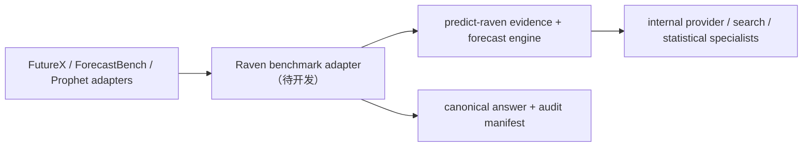

# 三个 Benchmark 端到端执行 Runbook

最后核验：2026-08-09，新加坡时间。

本文说明怎样用 `raven-gonna-test` 完成 FutureX、ForecastBench 和 Prophet Arena 的一次可审计测试，并列出正式参赛前仍需开发或人工完成的事项。规则会变化；每轮必须重新检查官方页面和主办方回信。

> **已确认的系统选择：Raven-only。** 三榜的正式候选必须由我们自研的 `predict-raven` / Raven 预测系统生成。第三方专用预测模型不再是候选生成路径。Raven 内部调用的基础模型、搜索工具或数据源只是实现组件，必须写入审计 manifest，但公开参赛系统名保持为 `Raven`。

> **当前硬阻断：** `raven-gonna-test` 当前 `main` 的付费命令仍实例化旧的 OpenAI-compatible client；它还没有接入 `predict-raven`。因此，本手册中的 baseline、下载、路由、校验和评分命令可立即使用；所有带 `--allow-paid` 的 benchmark 命令，只有完成第 7 节 Raven adapter Gate 后才能运行。不能仅把旧配置里的 model 字符串改成 `raven`。

## 1. 最终要交付什么

一次成功的三榜测试应产生四类结果：

1. 三个 benchmark 的合法候选：
   - FutureX：完整 `{id,prediction}` JSONL；
   - ForecastBench：完整 GCS-ready JSON；
   - Prophet Arena：通过兼容性测试的 HTTPS endpoint。
2. 每次模型运行的 checkpoint、manifest、输入 hash、模型配置和 fallback 记录。
3. 本地 validator/scorer 报告，以及明确的“可提交/不可提交”状态。
4. 人工提交或部署后的时间、对象 hash、回执和线上验收证据。

仓库不会自动发邮件、上传 GCS、执行 onboarding 或进行任何交易。外部动作始终由人类明确完成。

## 2. 状态标签

本文用三种标签区分现实状态：

- **[已实现]**：当前 `main` 上存在并经过本地测试的命令或校验。
- **[人工]**：需要账号、邮件、网页、托管环境或主办方确认。
- **[待开发]**：冲分或运营能力尚未实现；不能把它当成当前命令的行为。
- **[阻断]**：条件不满足时必须停止，不能靠 fallback 或改名绕过。

### 2.1 Raven 的现有能力边界

`predict-raven` 当前已有一条可审计的二元预测链路：Round 0 框定问题，随后多轮搜索新证据，以 log-odds 更新 `P(YES)`，并保存 `state.json` 和 `report.md`。它与交易链路分离，也不需要市场价格。

但当前 engine 只支持二元 yes/no。三个 benchmark 还需要单选、多标签、数值、排名、开放文本，以及一个问题内的多 horizon / 多 outcome 联合预测。因此当前真实架构是：



禁止把 benchmark adapter 直接连到旧的第三方预测 endpoint 后仍将结果称为 Raven。

## 3. 开跑前先填写决策表

在任何付费调用前，把下表保存到本轮运行目录的 `run-decisions.md`。未确定的字段不得靠脚本猜测。

| 字段 | 示例 | Gate |
| --- | --- | --- |
| Public system name | `Raven` | 三榜保持稳定；不要写内部基础模型名 |
| Agent framework | `raven-gonna-test` | 用于 benchmark adapter 与产物打包 |
| Organization | `<stable-organization>` | 由用户确认后固定；不由脚本猜 |
| `predict-raven` revision | 完整 40 位 Git SHA | 不接受 branch、`main` 或短 SHA |
| Raven adapter revision | `raven-gonna-test` 完整 Git SHA | 必须包含实际 adapter 代码 |
| Raven backend | `local-library` 或 `private-service` | live 前只允许一种已验收路径 |
| Internal provider/model | 例如 `claude/<raw-model-id>` | 仅作可复现审计；不能冒充 Raven 身份 |
| Evidence rounds | pilot `1`，正式上限 `<N>` | 必须有硬上限与提前停止条件 |
| Independent replicates | pilot `1`，adaptive `1/3/5` | replicates 共享冻结证据，不重复检索 |
| Evidence policy | official-first + cutoff | 每条证据必须不晚于 `as-of` |
| 本轮 Raven 预算 | token/API/订阅分别列出 | 目前由人工 dashboard 控制 |
| Fallback 上限 | `2%` | 正式候选超过即失败 |
| FutureX deadline | 主办方确认值 | 冲突时取最早值 |
| ForecastBench due date | dated question set 根字段 | 不用推测日期代替官方文件 |
| Prophet wire/SLA | onboarding 测试结果 | 未确认不得公开切流 |
| 外部提交责任人 | 姓名/邮箱 | CLI 不会代替此人提交 |

> **当前限制：** 仓库还不会计算 Raven 的 framing、evidence rounds、summary、统计工具和内部 provider 的总成本，也没有进程级 hard cap。运行者必须在各内部 provider dashboard 设置余额/告警，并在付费整轮前用 Raven pilot 测量真实 usage。

## 4. 推荐的运行目录

每轮使用新目录，不用 `--force` 覆盖旧产物：

```text
runtime-artifacts/
  runs/<run-id>/
    run-decisions.md
    preflight/
    raven/
      engine-identity.json
      engine-config.redacted.json
      usage-summary.json
      tasks/<task-id>/
        state.json
        report.md
        frame.json
        evidence-ledger.json
        source-trace.json
    futurex/
      questions.json
      questions.json.manifest.json
      routes.json
      routes.json.manifest.json
      pilot.json
      pilot.json.checkpoint.json
      submission.jsonl
      submission.jsonl.manifest.json
    forecastbench/
      questions.json
      baseline.json
      candidate.json
      candidate.json.checkpoint.json
      candidate.json.manifest.json
    prophet/
      request.json
      response.json
      response.json.manifest.json
      service-smoke/
    final-review.md
```

推荐 `run-id`：`YYYY-MM-DDTHHMMSSZ-<round-or-purpose>`。

## 5. 阶段 A：外部准入

这些动作可与本地开发并行，但正式提交前必须完成。

### A1. FutureX

**[人工]** 发信至 `FutureX-ai@outlook.com`，至少确认：

1. 下一轮 full dataset SHA、事件窗口和最早有效 deadline；
2. 重发是否覆盖、允许几次；
3. Raven 的多轮研究、ensemble 和人工 review 是否允许；
4. production scorer 版本、L3/L4 judge、numeric sigma；
5. 邮件正文要求和公开/私有展示方式。

不要交 Raven 内部 provider 的 API key。现行流程是本地生成文件后人工邮件提交。

### A2. ForecastBench

**[人工]** 发信至 `forecastbench@forecastingresearch.org`，提供主办方要求的 Google 邮箱、organization/匿名选择、网站和方形 SVG logo。收到 GCS folder 后：

1. 用无效测试文件验证权限和目标目录；
2. 删除或隔离测试对象，避免被当成正式提交；
3. 确认下一轮 due date、organization 和稳定 model name；
4. 记录 bucket/folder，但不要把凭证提交到 Git。

### A3. Prophet Arena

**[人工]** 通过 [Prophet Arena Onboarding](https://www.prophetarena.co/onboarding) 确认：

1. current 还是 legacy wire contract；
2. evaluator 是否携带 Bearer token；
3. timeout、retry、并发和请求重复策略；
4. 多 outcome 是 exclusive、Top-K、threshold 还是独立市场；
5. rationale 字段、公开榜资格和替换 active endpoint 的规则。

当前公开材料存在协议漂移，兼容性测试结果优先于仓库假设。

## 6. 阶段 B：本地环境与安全 preflight

### B1. 同步并验证仓库

**[已实现]** 在独占 worktree 中运行：

```bash
cd /Users/Aincrad/dev-proj/raven-gonna-test
git status --short --branch
git pull --ff-only
pnpm install --frozen-lockfile
pnpm verify
pnpm doctor
```

通过条件：

- worktree 没有来源不明的修改；
- boundary、TypeScript 和 tests 全绿；
- `doctor`、boundary、TypeScript 和 tests 均无失败；
- `externalSubmission` 仍为 `disabled-by-design`；
- 没有钱包、交易或资金能力。

当前 `doctor` 仍显示旧 client 的 model/base URL；在 Raven adapter 完成前，它只能证明仓库配置可解析，**不能**证明 Raven 已接通。不能把退出码 `0` 当成 Raven 付费 preflight 已通过。布尔参数必须写成裸 flag，例如 `--allow-paid`，不要写 `--allow-paid=true` 或 `--baseline-only=false`。

### B2. 固定 Raven 源码与现有 engine

**[已实现：Raven 源码]** 先记录实际使用的 `predict-raven` revision；不要让运行时悄悄跟随 `main`：

```bash
RAVEN_SOURCE_DIR="/Users/Aincrad/dev-proj/predict-raven"
git -C "$RAVEN_SOURCE_DIR" status --short --branch
git -C "$RAVEN_SOURCE_DIR" rev-parse HEAD
git -C "$RAVEN_SOURCE_DIR" remote get-url origin
```

把完整 SHA 写入 `run-decisions.md`。如果 worktree 有无关未提交修改，不要清理或覆盖；为 benchmark adapter 使用独立 worktree/revision。

现有二元 Raven engine 可以单独做 smoke，但这不是 benchmark candidate：

```bash
cd "$RAVEN_SOURCE_DIR"
FORECAST_PROVIDER="claude" \
FORECAST_MAX_ROUNDS="1" \
ARTIFACT_STORAGE_ROOT="<absolute-audit-directory>" \
pnpm forecast:event -- \
  "Will a clearly specified event resolve YES by the stated date?" \
  --resolution "YES iff the named official source reports the specified event by the cutoff; otherwise NO." \
  --max-rounds 1 \
  --fresh
```

这条命令可能使用订阅或 API 额度，必须经费用批准后运行。当前支持的 provider 是 `claude` 或 `deepseek`；认证只放 shell/secret manager。`state.json` 中的 `currentProb`、round history、sources 和 cost 是后续 adapter 的输入面。

严禁使用 `daily:forecast` 或 `forecast:live`；它们属于 `predict-raven` 的真钱交易流程。benchmark 只允许 `forecast:event`、纯 forecast engine 或专用 forecast API。

当前 Raven 服务的跨仓入口是异步 forecast contract，而不是 OpenAI chat contract：

```text
POST /v1/forecasts
GET  /v1/forecasts/<id>
```

现有 POST 主要接收 `question/maxRounds/fresh/provider/wait`，缺少 benchmark 所需的固定 resolution、task ID、`asOf`、per-request InformationPolicy、trial namespace、exact model 和完整 usage。这些都是 adapter/API 必须先补齐的字段。

只做现有 binary API smoke 时，可在 `predict-raven` 独占 worktree 中启动：

```bash
FORECAST_PROVIDER="claude" \
FORECAST_MODEL="<pinned-raw-model-id>" \
FORECAST_MAX_ROUNDS="1" \
FORECAST_MIN_ROUNDS="1" \
FORECAST_API_TOKEN="<dedicated-secret>" \
FORECAST_API_MAX_CONCURRENT="2" \
ARTIFACT_STORAGE_ROOT="<absolute-isolated-root>" \
pnpm forecast:api
```

这只能验 Raven server/auth/polling 和二元输出，不能作为三榜 adapter 验收，也不能对历史题使用 live WebSearch 冒充 cutoff replay。

一个新的 Raven forecast 在正常情况下约包含 2 次 framing/audit、1–3 次 evidence round 和 1 次 summary，即约 4–6 次顺序底层调用，重试另计。初期必须固定外层 `replicates=1`；Raven 内部 rounds 与独立 replicates 是两个不同预算维度。只有加入独立 `runId/trialId` 和 artifact namespace 后，才能对少数高价值题追加 fresh replicate。

### B3. Raven benchmark adapter readiness **[阻断 + 待开发]**

在任何 benchmark `--allow-paid` 命令前，必须完成并验收：

1. `RavenBenchmarkRequest` 明确包含 task kind、prompt、choices/horizons/outcomes、resolution criteria、`asOf` 和信息政策；
2. `RavenBenchmarkResponse` 返回 canonical structured answer、置信信息、证据引用、Raven revision、adapter revision、内部 provider/model、usage 和错误分类；
3. 支持 `binary_probability`、`single_choice`、`multi_choice`、`numeric`、`ranking`、`open_text` 六类输出；
4. ForecastBench 同一原题一次联合返回全部 horizons；Prophet 同一 event 一次联合返回全部 outcomes；
5. provider/store 可注入，checkpoint identity 绑定 input、route、as-of、Raven SHA、adapter SHA 和 policy hash；
6. evidence fetch 强制 `publication_time <= asOf`，保存正文/数据 hash，网页中的指令不进入 agent control plane；
7. benchmark 包不得 import 交易、钱包、订单、仓位或市场执行代码；
8. adapter 失败必须 fail closed，不得静默走旧 client 或把 baseline 标成 Raven；
9. deterministic fixtures、contract tests、cutoff tests、resume tests 和 cost telemetry 全绿；
10. `pnpm doctor` 新增 Raven readiness，明确打印 Raven SHA、adapter SHA、backend、provider、round cap 和 external submission 状态。

目标配置面可以使用下面的名字，但在代码实现前它们只是契约草案，不能当成当前可用环境变量：

```text
RAVEN_SOURCE_REVISION=<40-char-sha>
RAVEN_BACKEND=local-library|private-service
RAVEN_API_BASE_URL=<loopback-or-approved-private-url>
RAVEN_API_TOKEN=<dedicated-client-secret>
RAVEN_API_TIMEOUT_MS=<bounded-integer>
RAVEN_API_POLL_MS=<bounded-integer>
RAVEN_API_MAX_IN_FLIGHT=<bounded-integer>
RAVEN_INTERNAL_PROVIDER=claude|deepseek
RAVEN_INTERNAL_MODEL=<raw-model-id>
RAVEN_MAX_EVIDENCE_ROUNDS=<bounded-integer>
RAVEN_ARTIFACT_ROOT=<absolute-directory>
```

若选择 HTTP seam，内部 provider key 只存在 Raven server。Raven server 必须设置专用 token——现有服务在 token 未配置时可能不鉴权，不能作为 benchmark 生产默认值。

### B4. 记录 Raven 内部 provider 初始状态

**[人工]** 在 `preflight/` 保存：

- 账户余额和 spend limit；
- rate limit；
- Raven revision、adapter revision、内部 model 可用性；
- 运行开始前累计费用；
- provider dashboard 截图或导出时间；
- 若使用订阅型 CLI，记录 plan、登录身份、使用上限和 extra API 是否另计费。

## 7. 阶段 C：先做 Raven Pilot

不得把第一次 Raven benchmark 调用做成三榜全量运行。B3 未通过时，只能执行无费用 baseline smoke 或 `predict-raven` 自身的二元 engine smoke。

### C1. 无费用 plumbing smoke

**[已实现]**：

```bash
pnpm cli prophet predict \
  --input fixtures/prophet-arena/current-request.json \
  --output runtime-artifacts/runs/<run-id>/prophet/baseline-response.json \
  --baseline-only

pnpm cli forecastbench run \
  --input fixtures/forecastbench/question-set.json \
  --output runtime-artifacts/runs/<run-id>/forecastbench/backtest-baseline.json \
  --organization Raven \
  --model-name source-safety-baseline-v1 \
  --model-organization Raven \
  --mode backtest \
  --baseline-only

pnpm cli forecastbench validate \
  --input fixtures/forecastbench/question-set.json \
  --submission runtime-artifacts/runs/<run-id>/forecastbench/backtest-baseline.json \
  --mode backtest
```

目标是验证 schema、文件写入、manifest 和 validator，不评估模型水平。

### C2. 3–10 题 Raven 付费 Pilot **[adapter 完成后]**

FutureX 新轮 route 完成审核后，先用 Raven 的单次预测配置。当前 CLI 尚未接入 Raven，所以下列命令是 adapter 验收后的目标入口；在此之前运行它会走旧 client，禁止用于正式测试：

```bash
pnpm cli futurex pilot \
  --input runtime-artifacts/runs/<run-id>/futurex/questions.json \
  --routes runtime-artifacts/runs/<run-id>/futurex/routes.json \
  --revision <40-char-sha> \
  --round <round-id> \
  --as-of <ISO-8601> \
  --ids <id-1,id-2,id-3> \
  --output runtime-artifacts/runs/<run-id>/futurex/pilot.json \
  --allow-paid
```

`pilot.json` 永远写 `submissionEligible=false`，不能改名后提交。

Pilot 通过条件：

- selected IDs 全部成功；
- parse error 为 0；
- fallback 为 0，或每个 fallback 都有可解释原因；
- 无 cutoff/end-time 违规；
- 输出格式与 route 一致；
- Raven framing、evidence、synthesis 的实际单题成本和 P50/P95 时延处于批准预算内；
- manifest 的 public system 是 `Raven`，并同时记录两个 repo SHA 和内部 provider/model；
- checkpoint 中没有来自其他 input/routes hash 的结果。

失败处理：保留 checkpoint 和 manifest 供调查。当前 `futurex pilot` 没有 `--resume` 入口；修复后使用新输出目录重新执行。`--resume` 只用于支持它的正式批处理命令。

## 8. 阶段 D：FutureX 逐步执行

官方入口：[官网](https://futurex.live/)、[Online 数据集](https://huggingface.co/datasets/futurex-ai/Futurex-Online)、[公开 scorer](https://github.com/Futurex-ai/Futurex-Eval)。当前 2026-08-05 截止轮已过期，只能 shadow；以下步骤用于下一有效轮。

### D1. Discover，但不自动采用 `main`

**[已实现]**：

```bash
pnpm cli futurex discover \
  > runtime-artifacts/runs/<run-id>/futurex/discovery.json
```

人工核对 README、commit 时间、题目窗口和 deadline。只有确认后才把完整 40 位 SHA 写入 `run-decisions.md`。

### D2. 固定版本下载

**[已实现]**：

```bash
pnpm cli futurex fetch \
  --revision <40-char-sha> \
  --output runtime-artifacts/runs/<run-id>/futurex/questions.json
```

通过条件：manifest 中 revision、record count、下载 URL 和 hash 完整；禁止使用 `main` 或短 SHA。

### D3. 生成并审核题型路由

**[已实现 + 人工]**：

```bash
pnpm cli futurex route \
  --input runtime-artifacts/runs/<run-id>/futurex/questions.json \
  --revision <40-char-sha> \
  --output runtime-artifacts/runs/<run-id>/futurex/routes.json

pnpm cli futurex inspect \
  --input runtime-artifacts/runs/<run-id>/futurex/questions.json \
  --routes runtime-artifacts/runs/<run-id>/futurex/routes.json \
  --as-of <ISO-8601> \
  > runtime-artifacts/runs/<run-id>/futurex/inspect.json
```

路由必须按 prompt 规定的输出形态决定，不能按 Level 猜题型。逐题检查：

- `kind`：single/multi/numeric/ranking/open；
- choices 的 key 与文本；
- ranking 的精确 `rankCount`；
- numeric 的单位、尺度和小数位；
- prompt 中的拼写是否必须原样使用；
- `end_time` 与本轮 as-of；
- 自动 inference confidence/reasons。

每条 route 从 `pending` 改成：

```json
{
  "review": {
    "status": "approved",
    "reviewedAtUtc": "2026-08-10T00:00:00+08:00",
    "notes": "Choice keys and output count checked against prompt."
  }
}
```

若修改了 kind/choices/rankCount，使用 `status: "edited"` 并说明原因。付费 pilot 和正式 run 会在调用模型前阻断未审核 route。

当前 route 命令生成的 sidecar manifest 不会在人工编辑后自动重签；正式身份以实际 routes 文件 hash 和 checkpoint identity 为准。重新签名 route manifest 仍是待开发项。

### D4. Pilot 与可选人工研究快照

先执行阶段 C 的 3–10 题 pilot。若使用独立人工/ensemble 研究，按 research snapshot schema 保存并验证：

```bash
pnpm cli futurex research-validate \
  --input runtime-artifacts/runs/<run-id>/futurex/questions.json \
  --routes runtime-artifacts/runs/<run-id>/futurex/routes.json \
  --snapshot runtime-artifacts/runs/<run-id>/futurex/research-snapshot.json \
  --revision <40-char-sha>
```

研究快照允许部分覆盖，但固定不可提交。每条证据必须保存 URL 和 `observedAtUtc`。

### D5. Raven 全量候选 **[adapter 完成后]**

Pilot 通过且预算批准后才能运行。当前 `main` 尚不满足此条件；命令保留为 adapter 完成后的验收入口：

```bash
pnpm cli futurex run \
  --input runtime-artifacts/runs/<run-id>/futurex/questions.json \
  --routes runtime-artifacts/runs/<run-id>/futurex/routes.json \
  --revision <40-char-sha> \
  --round <round-id> \
  --as-of <ISO-8601> \
  --deadline <ISO-8601> \
  --output runtime-artifacts/runs/<run-id>/futurex/submission.jsonl \
  --allow-paid
```

若网络中断且 input、routes、Raven SHA、adapter SHA、internal provider/model、round/replicate policy 和 as-of 完全未变，可在相同命令末尾加 `--resume`。不要用 `--force` 掩盖身份冲突。

### D6. 严格校验

```bash
pnpm cli futurex validate \
  --input runtime-artifacts/runs/<run-id>/futurex/questions.json \
  --routes runtime-artifacts/runs/<run-id>/futurex/routes.json \
  --submission runtime-artifacts/runs/<run-id>/futurex/submission.jsonl \
  --deadline <ISO-8601> \
  > runtime-artifacts/runs/<run-id>/futurex/validation.json
```

Gate：100% ID 覆盖，无重复/额外 ID；prediction 全为 scalar string；numeric、ranking、multi-label 全部符合 route；deadline 未过；manifest/hash 一致。

### D7. 人工提交

> **邮件模板见 [`futurex-submission-email.md`](futurex-submission-email.md)**（含字段说明、取值命令与已发实例）。

**[人工]** 邮件附件只放官方 JSONL，正文至少写：model `Raven Forecasting Engine 0.1 (<predict-raven-sha>)`、agent framework `raven-gonna-test (<adapter-sha>)`、organization、dataset full SHA 和 visibility。内部 provider/model 另列在审计 metadata；若主办方要求也如实披露。发送后保存：

- sent time；
- 收件人/主题；
- 附件 SHA-256；
- 邮件 message ID 或截图；
- 主办方回执。

### D8. 结算后评分

```bash
pnpm cli futurex score \
  --gold <resolved.jsonl> \
  --submission runtime-artifacts/runs/<run-id>/futurex/submission.jsonl \
  --profile github \
  > runtime-artifacts/runs/<run-id>/futurex/score-github.json

pnpm cli futurex score \
  --gold <resolved.jsonl> \
  --submission runtime-artifacts/runs/<run-id>/futurex/submission.jsonl \
  --profile paper \
  > runtime-artifacts/runs/<run-id>/futurex/score-paper.json
```

公开 scorer 与论文 numeric 规则存在漂移；两份结果必须并列保存，不能把近似分数写成官方榜分。

## 9. 阶段 E：ForecastBench 逐步执行

官方入口：[提交 Wiki](https://github.com/forecastingresearch/forecastbench/wiki/How-to-submit-to-ForecastBench)、[题集](https://github.com/forecastingresearch/forecastbench-datasets/tree/main/datasets/question_sets)。

### E1. 在正式窗口读取 dated set

```bash
pnpm cli forecastbench fetch \
  --question-set <YYYY-MM-DD-llm.json> \
  --output runtime-artifacts/runs/<run-id>/forecastbench/questions.json
```

Gate：根字段 `forecast_due_date`、`question_set` 与文件名一致；500 原题恰为 250 market + 250 dataset。不要用旧题集生成 live candidate。

### E2. 先生成零费用安全基线

```bash
pnpm cli forecastbench run \
  --input runtime-artifacts/runs/<run-id>/forecastbench/questions.json \
  --output runtime-artifacts/runs/<run-id>/forecastbench/<due-date>.Raven.1.json \
  --organization Raven \
  --model-name source-safety-baseline-v1 \
  --model-organization Raven \
  --submission-number 1 \
  --baseline-only

pnpm cli forecastbench validate \
  --input runtime-artifacts/runs/<run-id>/forecastbench/questions.json \
  --submission runtime-artifacts/runs/<run-id>/forecastbench/<due-date>.Raven.1.json \
  --submission-number 1
```

基线的目的不是冲分，而是在模型故障时仍拥有 100% 合法文件。若使用历史 fixture 或处于正式窗口外，run 和 validate 都必须显式加 `--mode backtest`；backtest 只允许 `--baseline-only`。

### E3. Raven 成本 Gate

当前 `raven-gonna-test` 会把 500 原题展开成约 2,248 个 task；如果机械地把每个 task 交给多轮 Raven，不仅任务数过大，每个 Raven job 还可能包含 framing、若干 evidence rounds 和 summary。**该路径不获批准。** 正式 Raven adapter 必须让一个 dataset 原题一次联合返回全部 horizons，使每 replicate 的 Raven jobs 从约 2,248 降到约 500。

当前也没有 ForecastBench 付费 subset pilot；不能用不存在的参数假装小批量测试。

进入付费整轮前必须：

1. 完成 B3，且确认运行过程中没有旧 client fallback；
2. 用当前题型的小 fixture 实测一个 Raven job 的 framing/round/summary 成本与时延；
3. 用 ForecastBench subset pilot 验证 question-level vector output；
4. 在内部 provider 设置足以停止意外消费的余额；
5. 确认能在 24 小时窗口内完成；
6. 保留 baseline candidate；
7. 用户明确批准显示的 Raven jobs、预计内部调用数和预算。

### E4. Raven 付费候选 **[adapter + subset pilot 完成后]**

```bash
pnpm cli forecastbench run \
  --input runtime-artifacts/runs/<run-id>/forecastbench/questions.json \
  --output runtime-artifacts/runs/<run-id>/forecastbench/<due-date>.Raven.2.json \
  --organization Raven \
  --model-name raven-forecasting-engine-0.1 \
  --model-organization Raven \
  --submission-number 2 \
  --as-of <ISO-8601> \
  --max-fallback-rate 0.02 \
  --allow-paid
```

当前 `main` 运行这条命令仍会使用旧 client，因此现在禁止执行。实现后，preflight 必须在发出任何内部 provider 调用前打印 Raven jobs、round 上限、两份 repo SHA 和预计预算。

如果提供 fresh market snapshot，必须与 question set、as-of 和 source IDs 完整绑定；当前仓库没有自动抓取 snapshot 的命令，不得伪造实时性。

### E5. 严格校验

```bash
pnpm cli forecastbench validate \
  --input runtime-artifacts/runs/<run-id>/forecastbench/questions.json \
  --submission runtime-artifacts/runs/<run-id>/forecastbench/<due-date>.Raven.2.json \
  --submission-number 2 \
  > runtime-artifacts/runs/<run-id>/forecastbench/validation.json
```

Gate：

- market 和 dataset 均 100% row coverage；
- 每个 dataset question 的 horizon 完整；
- 概率均为有限 `[0,1]`；
- 无未知、重复或遗漏 key；
- `question_set` 逐字复制官方根字段；
- 文件名严格为 `<forecast_due_date>.<organization>.<N>.json`，`N` 只能 1–3；
- fallback rate 不超过批准值。

### E6. 人工上传与验收

**[人工]** 上传到主办方分配的 GCS folder。保存 object path、generation、上传时间和 SHA-256；重新下载并比对 hash。CLI 返回成功不等于 GCS 提交成功。

### E7. 结算后本地 raw Brier

```bash
pnpm cli forecastbench score \
  --input runtime-artifacts/runs/<run-id>/forecastbench/questions.json \
  --submission runtime-artifacts/runs/<run-id>/forecastbench/<due-date>.Raven.2.json \
  --resolutions <resolution-set.json> \
  > runtime-artifacts/runs/<run-id>/forecastbench/raw-brier.json
```

本地 scorer 是 raw Brier，不是官方 difficulty-adjusted leaderboard score。

## 10. 阶段 F：Prophet Arena 逐步执行

Prophet Arena 不是批量文件轮次，而是持续调用的在线 endpoint。

### F1. 本地 contract smoke

```bash
pnpm cli prophet predict \
  --input fixtures/prophet-arena/current-request.json \
  --output runtime-artifacts/runs/<run-id>/prophet/baseline-response.json \
  --baseline-only
```

完成 Raven adapter 后，再用小事件做一次显式付费测试：

```bash
pnpm cli prophet predict \
  --input runtime-artifacts/runs/<run-id>/prophet/request.json \
  --output runtime-artifacts/runs/<run-id>/prophet/paid-response.json \
  --residual-cap 0.05 \
  --allow-paid
```

当前 `main` 的付费路径不是 Raven；在 adapter 完成前只运行 `--baseline-only`。

### F2. 正式部署配置 **[Raven adapter 完成后]**

```bash
export PROPHET_HOST="0.0.0.0"
export PROPHET_PORT="8788"
export PROPHET_BEARER_TOKEN="<32+ byte random token>"
export PROPHET_MAX_CONCURRENT="8"
export PROPHET_PROVIDER_CONCURRENCY="8"
export PROPHET_MAX_OUTCOMES="40"
export PROPHET_REQUEST_TIMEOUT_MS="<confirmed SLA in ms>"
export PROPHET_WIRE_MODE="auto"
export PROPHET_ALLOW_BASELINE_ONLY="0"

pnpm prophet:serve
```

生产必须使用 HTTPS；Node 服务本身是 HTTP，应放在受控 TLS ingress/reverse proxy 后。secret 只放托管环境。

### F3. 本地 HTTP 验收

```bash
curl --fail --silent --show-error \
  http://127.0.0.1:8788/healthz

curl --fail --silent --show-error \
  -H "Authorization: Bearer ${PROPHET_BEARER_TOKEN}" \
  -H "Content-Type: application/json" \
  --data-binary @fixtures/prophet-arena/current-request.json \
  http://127.0.0.1:8788/forecast
```

还要测试：无 token、错误 token、非法 JSON、closed event、outcome 上限、重复请求、provider timeout 和进程重启。

### F4. 公网兼容性 Gate

**[人工]** 部署后完成：

1. 真实 HTTPS health；
2. 从外网发送官方 sample payload；
3. 检查响应 schema、label 顺序、概率 geometry 和时延；
4. 检查 audit 中 model/fallback/错误分类；
5. 负载测试不突破 provider 全局并发；
6. 连续 24 小时无 5xx；
7. 通过主办方 onboarding compatibility test；
8. shadow/canary 后才替换 active endpoint。

当前 schema 强制 `market_stats`，而部分新版官方 sample 可能不含该字段；正式 onboarding 前必须修复或由主办方确认。这是当前 live blocker。

### F5. 长期运营

Endpoint 需要持续在线，不存在“最后一小时提交”。必须监控：请求数、成功率、P50/P95、429/5xx、fallback、Raven round 数、内部 provider cost、队列和 artifact 磁盘。`prophet:serve` 没有逐请求 `--allow-paid` gate；切到 Raven 后，收到请求就可能产生订阅/API 消耗。当前尚未实现 Raven service wiring、完整 metrics/alerts 和 resolution ingest，因此不得 onboarding。

## 11. 最高分所需的共同预测流程

下面是目标系统，不代表当前全部完成。

### G1. 每个原始问题只研究一次 **[待开发]**

1. 固定 question hash 和 evidence cutoff；
2. 抓取第一方结算源、结构化数据和独立反证；
3. 保存正文快照、publication time、observed time 和 source hash；
4. 剥离网页内指令，禁止 post-cutoff 内容；
5. 生成短、冻结的 evidence bundle；
6. 多个 replicates 共享该 bundle，不重复付费检索。

### G2. 题型/领域专家 **[部分待开发]**

- FutureX：选择题概率、多标签 expected-F1、数值 nowcast、排名成员+顺序、开放实体名；
- ForecastBench market：最新有效 prior、独立证据、概率校准；
- ForecastBench dataset：DBnomics/FRED/YFinance/ACLED/Wikipedia 的 source-specific 统计模型；
- Prophet：market prior + 有证据的 bounded residual，并按事件 geometry 联合预测。

### G3. Adaptive compute **[待开发]**

1. 一次低成本预测覆盖全部题；
2. 按 benchmark 权重、uncertainty、模型分歧和预计改分排序；
3. 只给高价值题增加到 3 replicates；
4. 极少数题增加到 5 replicates 或人工复核；
5. 分类用概率/logit 聚合，数值用 median/trimmed mean，排名用 membership vote + Borda；
6. 最终答案由 deterministic canonicalizer 生成，不让最后一个模型随意改格式。

### G4. 时间顺序回测 **[待开发]**

历史评测只允许使用当时已存在的 frozen evidence。必须报告：

- benchmark/level/source/domain 分层得分；
- Brier、ECE、numeric error、ranking overlap；
- fallback/parse/coverage；
- 每题成本和时延；
- 新策略相对安全基线的 paired delta。

没有时间截断证据，就不能声称策略提高 live 分数。

## 12. Raven 成本和时间 Gate

旧的单模型价格表不适用于 Raven。Raven 是多阶段系统，一个 Raven job 可能包含 framing、`R` 个 evidence rounds、一次 synthesis、结构化/统计工具和必要的重试。内部 provider 又可能分别走订阅额度、extra API 或按 token 计费，所以在 Raven pilot 前不写一个看似精确的美元数。

### 12.1 工作量口径

| 阶段 | FutureX | ForecastBench | Prophet sports sample | 总 Raven jobs / replicate |
| --- | ---: | ---: | ---: | ---: |
| 当前机械展开（禁止正式跑） | 84 | 2,248 | 约 183 outcomes | 约 2,515 |
| adapter 批处理目标 | 84 | 500 原题 | 约 16 events | 约 600 |

FutureX 每周题数、ForecastBench horizons 和 Prophet events 都会变化，必须从 pinned input 动态计算。Prophet 长期榜没有有限的“一轮总量”。

Raven 内部调用规划公式：

```text
upstream calls
  ≈ Raven jobs × replicates × (framing + evidence_rounds + synthesis + retries)

cash cost
  = token/API usage cost
  + paid search/data cost
  + subscription overage or extra API cost
  + hosted Raven service cost
```

同一原题的 replicates 必须共享一次冻结 evidence bundle，否则 research 成本会随 replicates 重复放大。对于 source-specific 数值题，统计程序能直接出结果时，不应强行启动完整 Raven web rounds。

### 12.2 Pilot 后必须实测

在 `run-decisions.md` 写入：

- 每种题型的 prompt/input、output、search 和总 token；
- framing/evidence/synthesis 各自调用数和 P50/P95；
- 每轮平均新增证据数、提前停止比例和 retry；
- API 费用、订阅额度消耗、extra API 费用与托管费用分别是多少；
- 一个 job、一个原题和整个 pinned round 的 P50 / worst-case 外推；
- hard budget、soft alert 和 kill condition。

只有 pilot 产物能证明这些数字。未经实测不得把旧价格、基础模型官网均值或订阅宣传额度当作 Raven 整轮费用。

## 13. 截止时间安排

### FutureX

- T−4h：完整候选和 manifest；
- T−2h：只有完整重跑仍能按时完成时才更新候选；当前没有“选择性刷新并安全合并”命令；
- T−75m：冻结输入和答案；
- T−60m：validate 后发邮件；
- T−30m：确认 sent/hash/回执，不再大规模重跑。

### ForecastBench

- 窗口开启：立即下载 dated set；
- T−6h：100% baseline；
- T−4h：至少一个完整合法候选；
- T−2h：结束高时效刷新；
- T−90m：上传正式对象；
- T−60m：重新下载并核 hash；
- T−30m：必要时执行主办方认可的邮件 fallback。

不要在最后一小时才第一次全量运行。晚信息只值得用于少数动态题，不值得交换文件损坏、429 或无回执风险。

## 14. 故障与恢复

| 故障 | 处理 |
| --- | --- |
| Provider 429/5xx | 保留 checkpoint；等待 Retry-After；禁止盲目增加并发 |
| 单题 parse 失败 | 记录 raw response；修 parser/route；不得静默当成功 |
| Fallback 超限 | 候选失败；保留安全 baseline；不得提交为模型成绩 |
| input/route hash 变化 | 新建 run 目录；不得 resume 旧 checkpoint |
| deadline 已过 | 停止 live candidate；只能标记 shadow/backtest |
| 输出已存在 | 新建文件名；只有明确核对旧 hash 后才考虑 `--force` |
| 外部上传失败 | 在预留缓冲内重试；保存错误；遵循主办方认可的 fallback |
| Prophet provider 故障 | 保持显式 fallback/audit；恢复后先 canary，不直接全量切换 |

## 15. 开发优先级

### P0：下一次付费整轮前

1. 实现并验收 Raven benchmark adapter，彻底移除 live candidate 对旧 client 的依赖；
2. 扩展 Raven 结构化输出：binary、single、multi、numeric、ranking、open；
3. 每份产物绑定 `predict-raven` SHA、adapter SHA、内部 provider/model、as-of、policy 和 usage；
4. ForecastBench：每个原题一次生成全部 horizons，`2,248 → 500 Raven jobs/replicate`；
5. Prophet：每个 event 一次联合预测全部 outcomes；
6. 按原题缓存 research，replicates 复用冻结 evidence；
7. 增加 token/API/订阅预算 hard cap、usage 汇总和 kill switch；
8. 修复 Prophet 新版 sample/`market_stats`/auth/SLA 兼容性；
9. 增加 ForecastBench Raven subset pilot；
10. 完成历史整轮成本、时延和 parser/fallback 实测。

### P1：冲分

1. ForecastBench source specialists 与 horizon calibration；
2. FutureX domain specialists、multi-label expected-F1 和 numeric nowcast；
3. Prophet residual registry 和 category/time-to-close calibration；
4. frozen-evidence rolling backtest；
5. adaptive 1/3/5-replicate 预算分配；
6. 每个 job 显式 InformationPolicy：ForecastBench market/Prophet 可使用合法市场锚，dataset 走市场盲测，FutureX 按题面与规则选择；禁止全局开关污染三榜。

### P2：稳定运营

1. model/calibration/strategy registry；
2. durable provider queue、metrics、alerts 和 cost dashboard；
3. Prophet 容器/TLS/canary/滚动部署；
4. submission receipt/hash tracker；
5. resolution ingest 和每轮 postmortem。

另外仍需实现真正的 `run-all` 编排器。当前仓库没有 `run-all` 或 `--budget-usd` 命令，三个 benchmark 必须分别执行。

## 16. Definition of Done

只有全部满足，才能称为“三榜一次完整测试完成”：

- [ ] 固定了正确题集/revision 和信息 cutoff；
- [ ] 固定了 `predict-raven` 与 Raven adapter 两个完整 Git SHA；
- [ ] 正式候选的 public system 为 `Raven`，不存在旧 endpoint/client fallback；
- [ ] preflight、tests、doctor 全绿；
- [ ] Raven adapter 六种题型、联合 horizon/outcome、cutoff 和 resume contract tests 全绿；
- [ ] Raven 付费 pilot 通过并分别记录 token、API、订阅/extra API、search、cost 和 latency；
- [ ] 三榜本地输出均为 100% 完整合法；
- [ ] fallback、parse error、证据时间和 hash 已人工 review；
- [ ] FutureX 邮件候选已发送并留回执，或明确标记未提交；
- [ ] ForecastBench GCS 对象已上传、回读并核 hash，或明确标记未提交；
- [ ] Prophet HTTPS endpoint 通过兼容性测试和 24 小时验收，或明确标记仅本地；
- [ ] 没有 post-cutoff evidence；
- [ ] 没有自动外部提交、钱包、交易或资金动作；
- [ ] `final-review.md` 记录结果、未完成项和下一次改进。

## 17. 相关文档

- [三榜操作手册](benchmark-playbook.md)：规则、人工准入和截止时间摘要；
- [架构文档](architecture.md)：模块边界和数据流；
- [开发接力](agent-handoff.md)：当前状态与下一步；
- [开发计划](../Plan/2026-08-09-raven-gonna-test-development-plan.md)：P0–P2 路线图。
